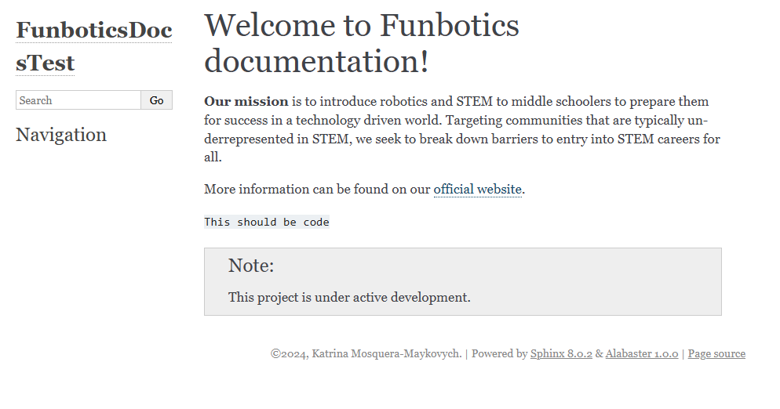

# Sphinx-Project
A Sphinx project created as a rudimentary introduction to Sphinx documentation.

## Preface
At the beginning of the semester, I intended to use Sphinx to generate documentation for Funbotics, a non-profit organization that brings STEM education to underprivileged middle school students.
However, due to my unfamiliarity with Sphinx (as well as pressing documentation deadlines), we instead opted to use GitBook as our primary documentation platform. Not only is it much easier to collaborate with multiple authors through GitBook, but GitBook offers a level of customizability that is, while entirely possible, much more difficult to acheive with Sphinx. I hope to revisit Sphinx in the future, as it is still a very powerful tool for generating documentation (especially for localized usage).

## index.html (test_site.png)
Below is a screenshot of what the test website looks like when built with Sphinx. Due to the number of required dependencies/system changes to reproduce the Sphinx environment for this project, I have opted to exclude the series of console commands that allowed me to build this project. I apologize in advance.

